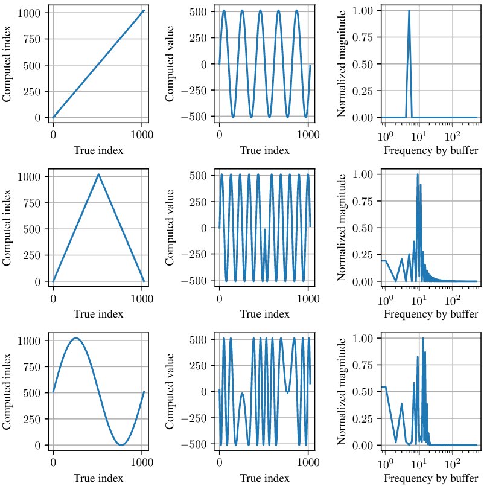
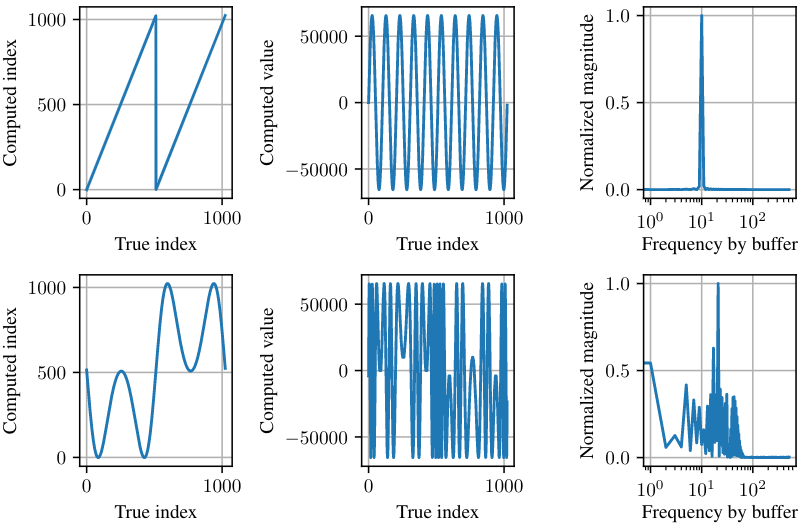

# cascaded-buffer-modulation

> ### [About](#about) | [Methods](#about) | [Results](#results) | [Paper](#paper)

## About
Much greater processing power allows for more creative ways for digital signal processing or more specifically, sound synthesis. Even embedded systems today are well suited to audio manipulation thanks to direct hardware access with read and write pointer manipulations. One of these manipulations is *buffer modulation* by which the reading pointer's position is not merely an incremental operation, but a function of itself, causing the digital equivalent of "turntable-scratching". This project explores the possibility for unique sound synthesis by chaining such functions in series, creating very obscured but mathematically simple representations of a buffer of audio dubbed *cascaded buffer modulation* without ever having to manipulate the original sound source itself.

## Methods
By defining indexing functions, an incremental indexing can be reshaped to a triangle, sine or arbitrary waveform which is then used to index an actual audio buffer. Such functions can be chained in series using a *linked list*, a popular and to some extent the only way of obtaining dynamic memory on an embedded system using the `C` programming language. The figures below demonstrate how a waveform (center) and its frequency response (right) changes when indexed by a non-linear function (left).
  
*Single different indexing functions*

  
*Tow different chained indexing functions*

The short code snippet below demonstrates the use of a linked list for calling functions via function pointers. For the full implementation, see [pointer.c](lib/waveform/pointer.cpp).
```C
typedef struct Indexer {
    void (*method)(uint16_t* i, uint16_t* o);
    uint16_t i;
    uint16_t o;
    struct Indexer* next;
} indexer_t;

void nextSaw(uint16_t* i, uint16_t* o){
    *o = *i;
}

void nextTriangle(uint16_t* i, uint16_t* o){
    if(*i < (f_end_pos-f_start_pos)/2){
        *o = 2*(*i);
    }
    else{
        *o = 2*((f_end_pos-f_start_pos)-*i);
    }
}

void nextSine(uint16_t* i, uint16_t* o){
    *o = (uint16_t)(sin(omega * (*i)) * (double)(((f_end_pos-f_start_pos)+1)/2 - 1)) + ((f_end_pos-f_start_pos)+1)/2;
}
```

## Results
Results are best served for the ear when it comes to sound. Below are the original sound samples and a short track manually composed from samples obtained via cascaded buffer modulation.

  
  
  
  
  

## Paper
The paper written at [TU-Berlin](https://www.tu.berlin/en/) as part of the AKT master's program can be found [here](/docs/Cascaded_Buffer_Modulation_for_Sound_Synthesis_on_Embedded_Systems.pdf).
